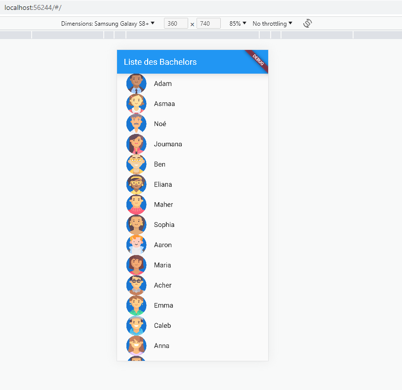
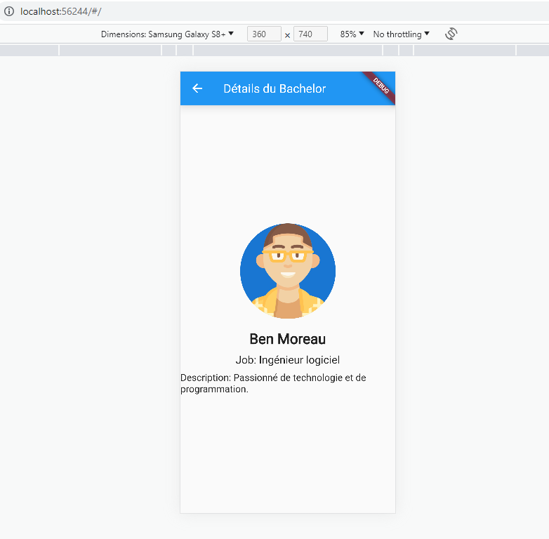
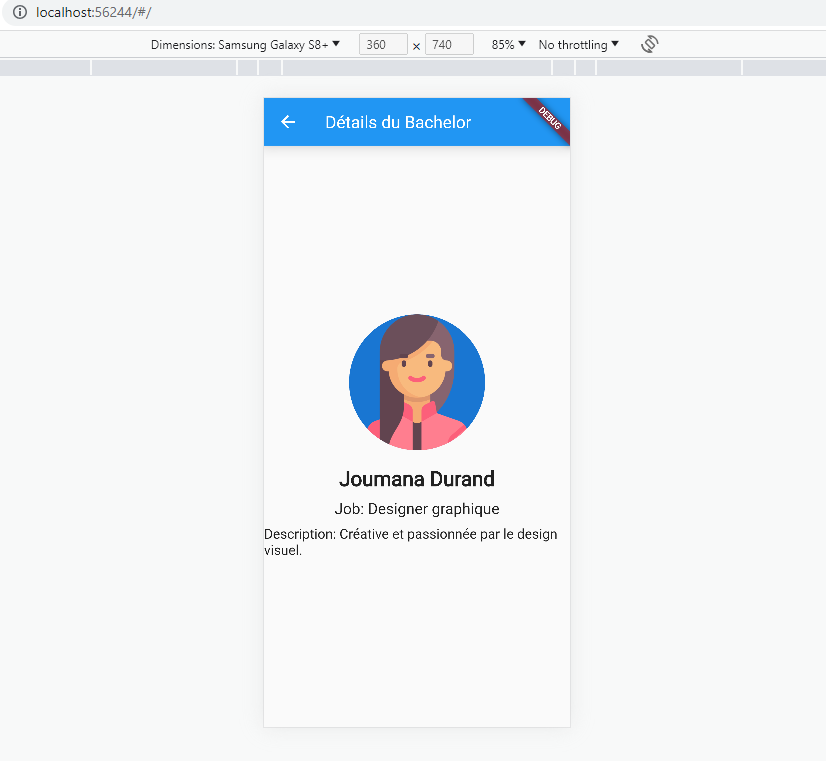

# finder

Ce projet est une application Flutter en cours de développement. Il vise à créer une application de gestion des Bachelors utilisant le modèle ergonomique Master/Details. L'application permettra aux utilisateurs de consulter une liste de Bachelors fictifs et d'accéder aux détails de chaque Bachelor. De plus, les utilisateurs pourront "liker" les Bachelors.

**Remarque :** Ce projet est en cours de développement et sera terminé dans les meilleurs délais.

## Réalisation [Hakima DJERMOUN]

## Description

Le projet vise à créer une application de gestion des Bachelors avec le modèle ergonomique Master/Details. L'application affiche une liste de Bachelors fictifs avec leurs informations de base et permet aux utilisateurs de consulter les détails de chaque Bachelor. De plus, les utilisateurs peuvent "liker" les Bachelors qu'ils préfèrent.

## Fonctionnalités

- Affichage d'une liste de Bachelors avec prévisualisation
- Navigation vers les détails d'un Bachelor
- Affichage des informations complémentaires d'un Bachelor
- Ajout d'un Bachelor à la liste des Bachelors likés (en cours/TDD dispo)
- Affichage de l'icône "Like" sur les Bachelors likés (en cours/ TDD dispo)

## Capture d'écran et jeu de test UI vidéo:

<video src="finder%20-%20Google%20Chrome%202023-07-02%2001-06-32.mp4" controls title="Title"></video>

## Installation

1. Assurez-vous d'avoir Flutter installé sur votre machine. 

2. Clonez ce dépôt de projet sur votre machine 

3. Accédez au répertoire du projet :
    cd  finder
4. Exécutez la commande suivante pour récupérer les dépendances nécessaires :
    flutter pub get
5. Lancez l'application sur un émulateur ou un appareil connecté :
    flutter run

## Contributions

Ce projet est en cours de développement et toute contribution est la bienvenue. Si vous souhaitez apporter des améliorations, veuillez ouvrir une pull request.

## Remarques

*Remarque :* Ce fichier README sera mis à jour au fur et à mesure que le projet avance. N'hésitez pas à revenir plus tard pour voir les nouvelles fonctionnalités et mises à jour !

